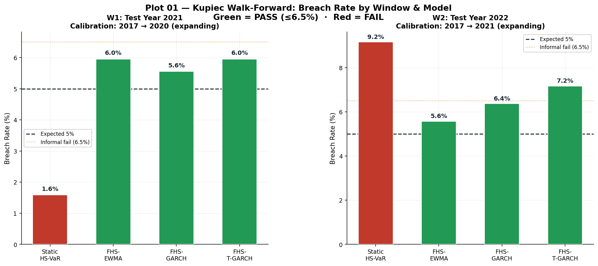
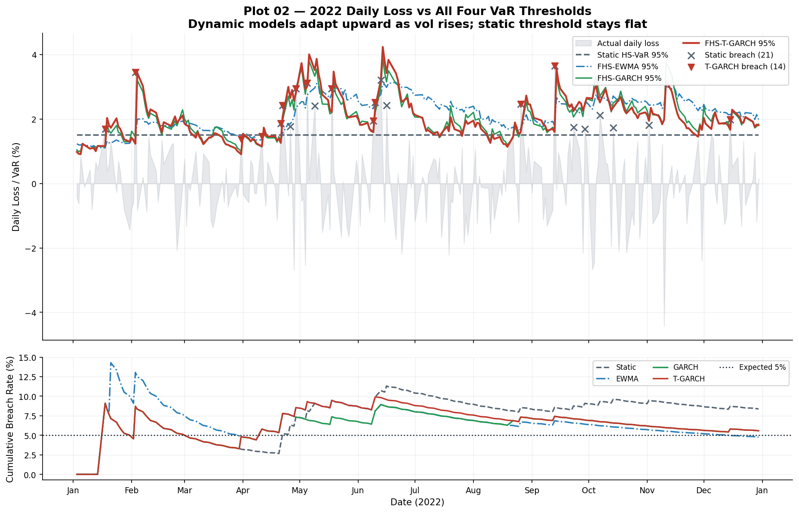
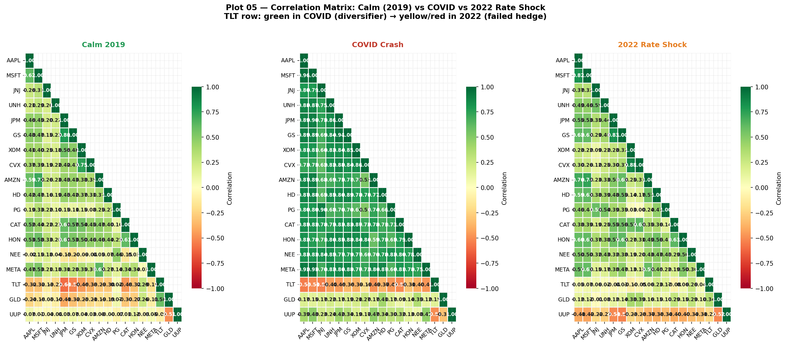
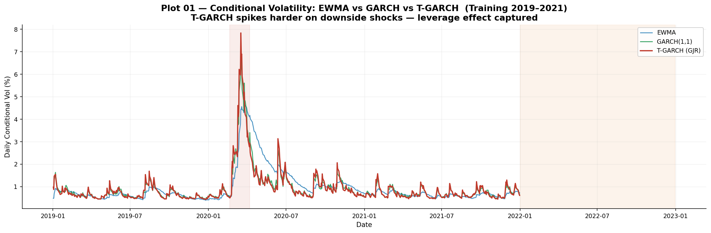
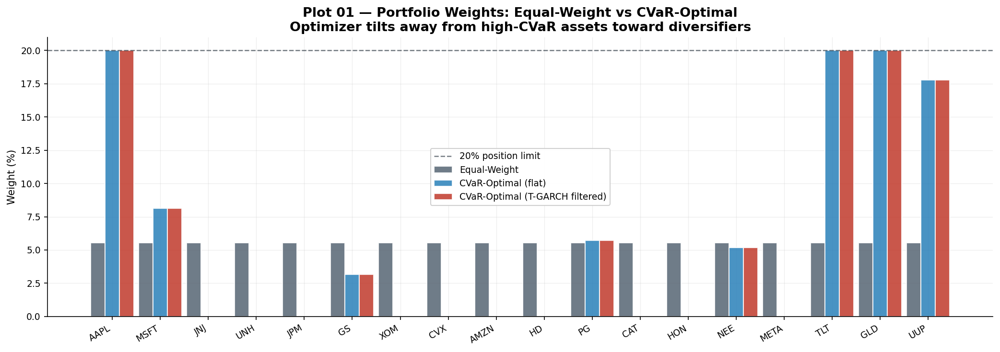

# Dynamic Var Stress Testing & Macro Scenario Engine

A market-risk engine that measures portfolio risk, backtests it honestly against out-of-sample data, and stress-tests it through real historical shocks. Built in Python and deployed as a live interactive dashboard.

**[Live dashboard](https://dynamic-var-stress-testing-engine-rk3qwtdff5nyyftrtqsfla.streamlit.app/)**

*Boopesh Mohanraj*

---

## What this is

A risk officer's core job is to answer one question every morning: if the market moves against us this week, how much do we lose, and can I even trust the model telling me so? Most student risk projects compute a single Value-at-Risk number and stop. The deeper problem is that a VaR model calibrated on calm markets quietly fails the moment volatility regime-shifts, which is exactly the moment it needs to hold.

This engine works that problem end to end. It runs an 18-position portfolio (15 single-name equities across 9 GICS sectors, plus TLT, GLD, and UUP as cross-asset ETF proxies) over 2017 to 2024, and does four things a real risk desk does:

1. **Measures** risk three static ways (Historical, Parametric, Monte Carlo VaR), plus CVaR and Expected Shortfall at the Basel III FRTB standard.
2. **Adapts** to volatility regimes using Filtered Historical Simulation on three conditional-volatility models (EWMA, GARCH, GJR-GARCH).
3. **Validates** every model with formal Kupiec and Christoffersen backtests on genuinely out-of-sample data, and reports where models fail rather than only where they pass.
4. **Stress-tests** the portfolio against forward scenarios and against day-by-day replays of the March 2020 COVID crash and the 2022 rate shock.

All of it feeds a live 9-panel dashboard, so the output is explorable rather than locked in a notebook.

---

## Key results

Every figure below is computed from the code in this repo and reproduced live in the dashboard.

### Static VaR fails through regime shifts; dynamic VaR holds

Using a walk-forward design (calibrate on 2017 to 2020, test 2021; recalibrate on 2017 to 2021, test 2022), **static Historical-Simulation VaR failed the Kupiec backtest in both out-of-sample years, while all three Filtered-Historical-Simulation models passed in both:**

| Model | 2021 breach rate | 2022 breach rate | Kupiec result |
|---|---|---|---|
| Static HS-VaR | 1.6% | 9.2% | Fails both years |
| FHS-EWMA | 6.0% | 5.6% | Passes both |
| FHS-GARCH | 5.6% | 6.4% | Passes both |
| FHS-GJR-GARCH | 6.0% | 7.2% | Passes both |

The target breach rate for a 95% VaR is 5%. The honest reading is not that one dynamic model wins outright. EWMA tracked the target most closely in 2022, while GJR-GARCH ran hot. The point is that volatility-adaptive VaR stays statistically valid through a regime shift where static VaR breaks down.



A second backtest sharpens this. The Christoffersen independence test checks whether breaches cluster, since a model can have the right breach *count* yet still fail if all its misses bunch together in the crisis. In 2022, GARCH and EWMA produced independent breaches, but **GJR-GARCH failed the independence test (p = 0.03)** as its breaches clustered during the drawdown. So the model with the strongest theoretical story for equities was not the best-behaved one in this specific stress window. That is the reason to run more than one test.

### The models work day by day, not just on average

Plotting 2022's actual daily losses against all four VaR thresholds shows the dynamic models widening ahead of the drawdown while the static threshold stays flat and gets breached repeatedly.



### Diversification assumptions broke in 2022, and the engine captures it

The equity-to-bond (TLT) correlation, reliably negative for decades, **flipped positive during the 2022 rate shock** as stocks and bonds fell together. A risk model resting on a stable historical correlation would have understated portfolio risk at precisely the wrong time.



### Conditional volatility models track the regimes

EWMA, GARCH, and GJR-GARCH all spike through the COVID and 2022 stress windows. That responsiveness is what lets the filtered VaR adapt.



### Mean-CVaR optimization cut tail risk, with a caveat worth stating

Implementing the Rockafellar and Uryasev linear program in `cvxpy` **reduced in-sample 95% CVaR from 19.0% to 3.0%.** The optimizer achieved this by concentrating into low-CVaR defensive assets (roughly 20% each into TLT, GLD, and the AAPL and UUP block). That concentration then hurt in the actual 2022 scenario: the **CVaR-optimal portfolio returned -15.4% against the equal-weight portfolio's -11.2%**, because long-duration Treasuries were themselves a primary casualty of the rate shock. This is a clean illustration of why a corner solution that minimizes a historical risk metric is not the same as a portfolio that survives the next specific shock, and why real mandates impose concentration limits.



---

## Methodology and academic references

Each component implements a specific paper. For each: what the paper gives, what I built, and what it produced here.

### Static VaR, CVaR, Expected Shortfall
*Basel III / FRTB (2019)*

- **Built:** 95% and 99% VaR three ways (Historical, Parametric via the cross-asset covariance matrix, Monte Carlo via Cholesky decomposition), plus Expected Shortfall at the 97.5% FRTB standard.
- **Result:** the three methods diverge exactly where their assumptions do, which the side-by-side comparison makes visible.

### Filtered Historical Simulation
*Barone-Adesi, Giannopoulos & Vosper (1998)*

- **Built:** standardized historical returns by their conditional volatility, then rescaled by the current volatility forecast.
- **Why it matters:** keeps the empirical fat tails from history while reacting to today's regime. This is the mechanism behind the dynamic models passing Kupiec where the static one fails.

### Conditional volatility
*Engle (1982) for ARCH; Glosten, Jagannathan & Runkle (1993) for GJR-GARCH*

- **Built:** EWMA (RiskMetrics, lambda = 0.94), symmetric GARCH(1,1), and asymmetric GJR-GARCH via the `arch` library.
- **Result:** the GJR leverage term was statistically significant (likelihood-ratio test, p = 0.0008), confirming that negative shocks raise volatility more than positive ones.
- **Naming note:** the dashboard labels this model "T-GARCH" as shorthand, but the model implemented (`arch_model(..., o=1)`) is GJR-GARCH, which is the correct citation.

### VaR backtesting
*Kupiec (1995) and Christoffersen (1998)*

- **Built:** Kupiec's proportion-of-failures test (is the breach count consistent with the VaR level?) and Christoffersen's independence test (are breaches clustered?), run across all four models.
- **Result:** turned validation into a model-comparison exercise, and surfaced the GJR breach-clustering result noted above.

### Mean-CVaR optimization
*Rockafellar & Uryasev (2000)*

- **Built:** their CVaR-minimization linear program, written directly in `cvxpy` rather than a black-box optimizer.
- **Result and caveat:** cut in-sample 95% CVaR from 19.0% to 3.0%, but concentrated into defensives and underperformed equal-weight in the 2022 duration shock (detailed in Key Results).

### Macro linkage
*Ang & Piazzesi (2003)*

- **Built:** regressed portfolio returns on changes in the Fed Funds rate, CPI, the 10Y yield, and the IG credit spread (R-squared = 0.49).
- **Result:** produced a sensitivity table (a +100bp move in the 10Y costs the portfolio about 4.7%), the one-line answer a CIO asks for. Out-of-sample on 2022, it called the direction of the loss correctly.

---

## Tech stack

| Layer | Tools |
|---|---|
| **Language** | Python |
| **Risk & stats** | NumPy, pandas, SciPy, statsmodels, `arch` (GARCH family) |
| **Optimization** | cvxpy (Rockafellar-Uryasev LP) |
| **Data** | Tiingo (prices), FRED (macro series) |
| **Storage & reporting** | SQLite (window-function risk queries) |
| **Visualization** | Plotly (interactive), Matplotlib (static) |
| **App** | Streamlit, deployed on Streamlit Community Cloud |

---

## Running it locally

```bash
git clone https://github.com/BoopeshMohanraj/Dynamic-Var-stress-testing-engine.git
cd Dynamic-Var-stress-testing-engine
pip install -r requirements.txt
streamlit run streamlit_app.py
```

The dashboard reads the pre-computed outputs already committed to `data/` and `results/`, so it runs immediately with no API keys required.

---

## Repository structure

```
streamlit_app.py     Live dashboard (9 panels)
data/                Prices, returns, covariance matrices, macro series
results/             VaR, backtest, stress, optimization, and macro outputs, plus SQLite DB
figures/             Selected result visualizations
requirements.txt     Dependencies
```

---

## Data and limitations

Stated plainly, because a risk professional who oversells a model is a liability:

- **Survivorship bias.** The equity universe uses currently-listed tickers, which excludes delisted names.
- **CVaR corner solution.** The optimizer concentrates into defensives; realistic mandates would impose tighter position and sector limits than the 20% and 35% caps modeled here.
- **Single-scenario stress.** Historical replays of COVID and 2022 are informative but are not a substitute for a full forward scenario distribution.
- **GARCH parameter drift.** The leverage parameter is estimated from history and shifts over time; rolling re-estimation only partially addresses this.
- **EVT excluded.** Extreme Value Theory tail-fitting was scoped out as beyond the level of this project and is noted as a natural extension.

---

* Data from public APIs (Tiingo, FRED) *
